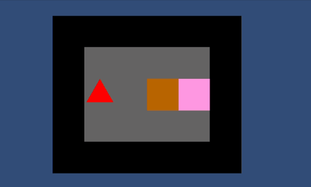

# sokoban-game
A game similar to Sokoban. Made using Unity and C#.

## Table of contents
* [General info](#general-info)
* [Technologies](#technologies)
* [Scripts](#scripts)
* [Preview](#preview)

## General info
It's a puzzle video game where player has to push the boxes to storage locations. Levels are read from txt files while running the game. 

## Technologies 
* Unity version 

## Scripts
### Level
read txt file

### Player 
player movement

### GameController
create the level from txt file and controls the game

## Preview

